# 二手交易平台

预览地址：[https://shinytengxvnyun.cn/](https://shinytengxvnyun.cn/)

1M宽带，网速较慢，请轻点。

## 用户登录和注册功能

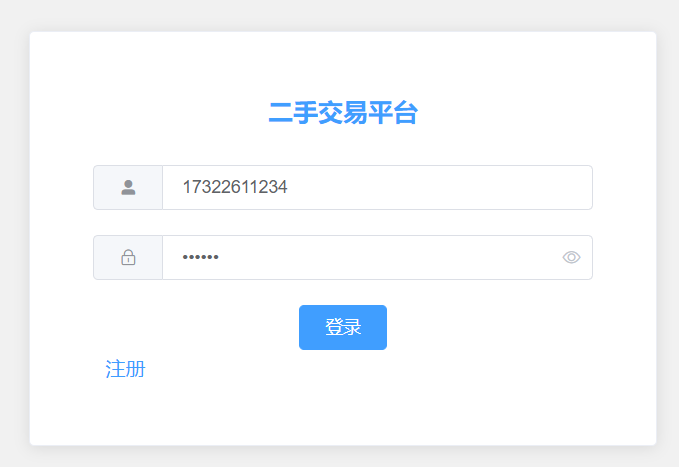

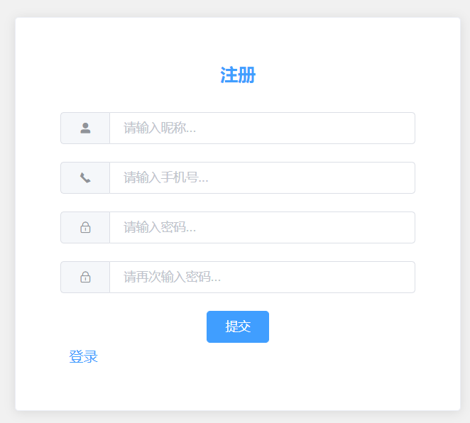

## 用户基本修改功能

​	 用户登录后可修改基本信息，如修改头像、修改昵称、修改密码，头像上传修改，昵称修改实时保存。

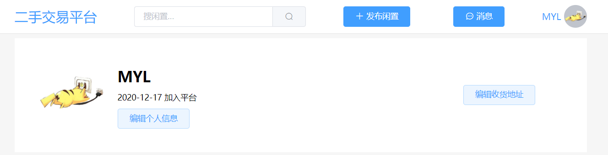

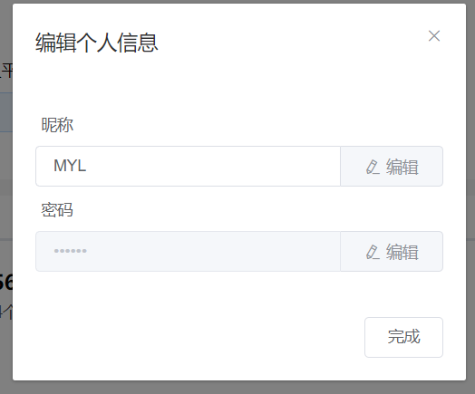

## 编辑地址功能

​	 添加新地址，没有任何地址时会设置为默认地址。可重新修改或删除地址信息。

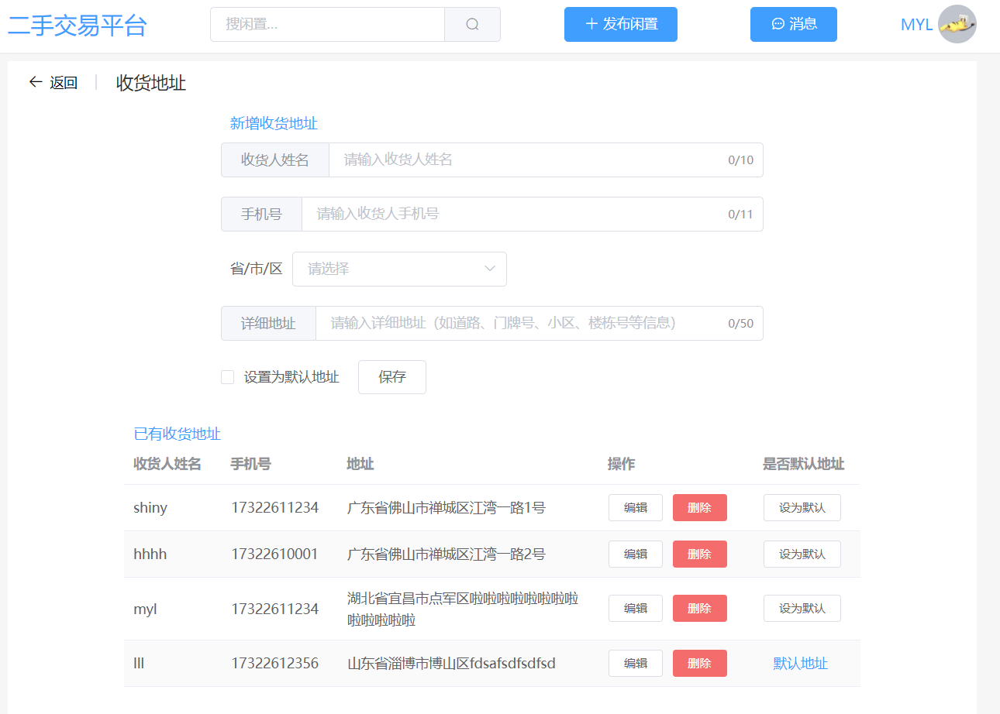

## 首页推荐功能

​	 首页推荐闲置物品并展示，优先显示最新发布的闲置，并可按分类显示。

## 搜索闲置物品功能

​	 全文模糊搜索，可根据闲置物品的标题和详细说明进行模糊搜索。

## 发布闲置功能

​	 发布闲置功能，填写完整闲置的信息即可发布，未登录用户无法发布闲置。

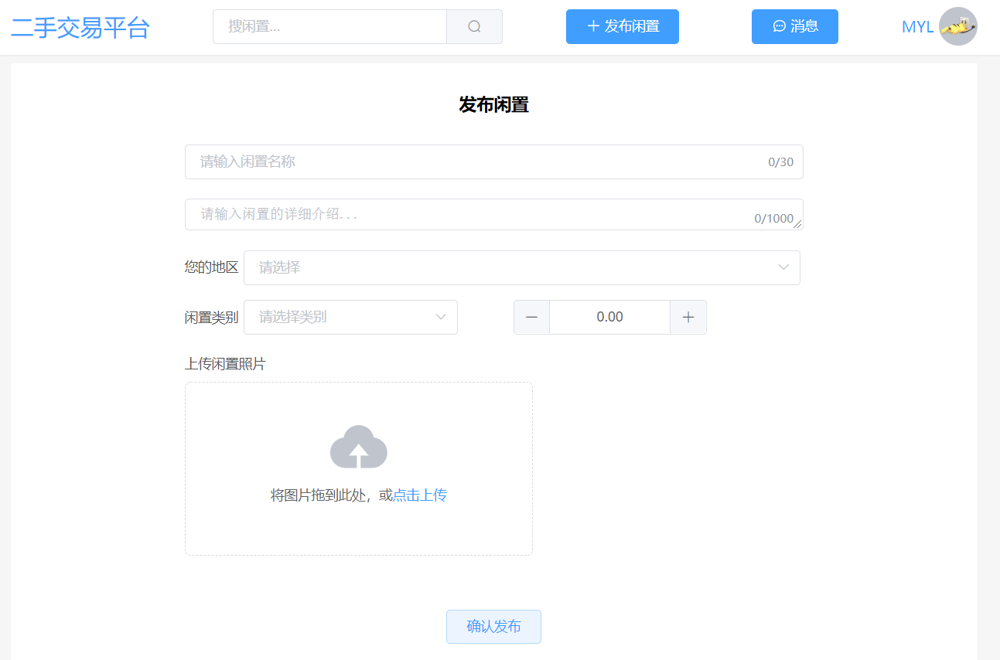

## 查看闲置详情功能

​	 可以查看闲置的详细介绍说明和图集，并能看到发布者的信息，可以下单购买或收藏。如果是自己发布的闲置，可以进行下架操作或重新上架。

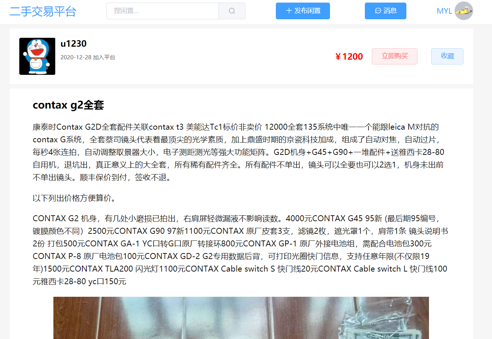

## 留言功能

​	 可以在闲置详情页发送留言，也可以在消息页面看到别人给自己的留言或回复。

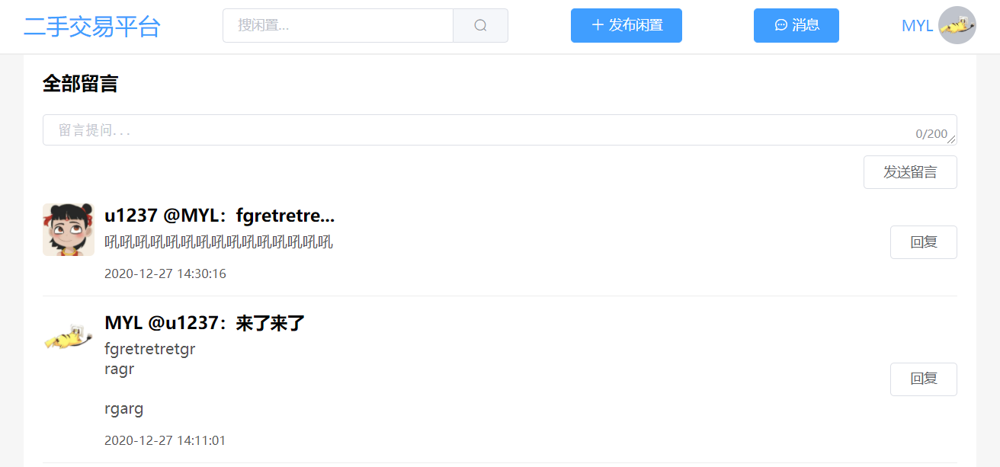

 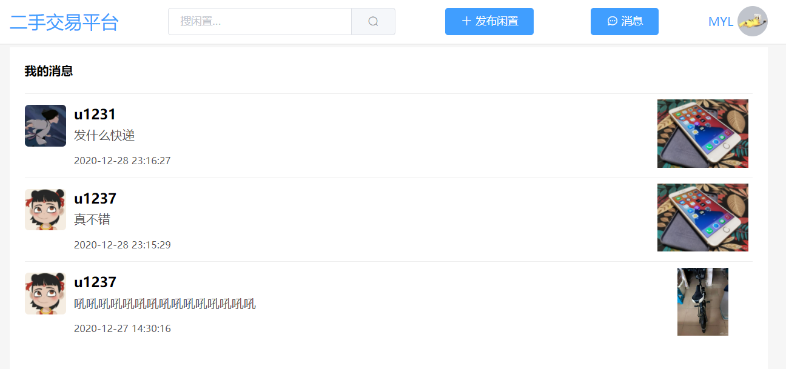

## 下单功能

​	 可购买闲置进行模拟支付，下单前或自动选择默认收货地址，也可以修改收货地址，也可以取消下单。生成订单后，闲置会马上下架，发布者可选择重新上架。

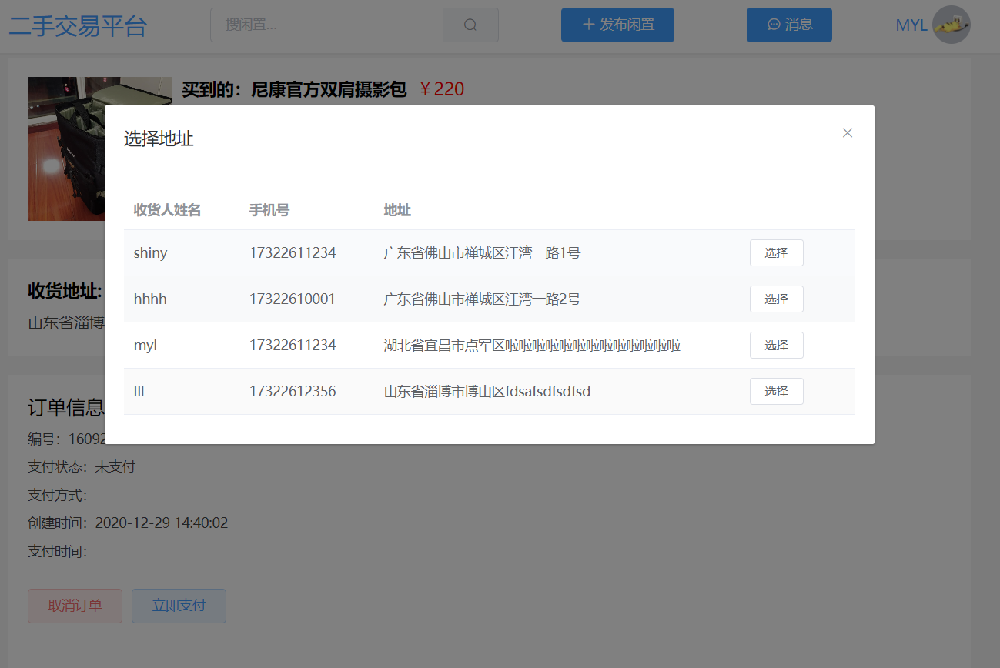

 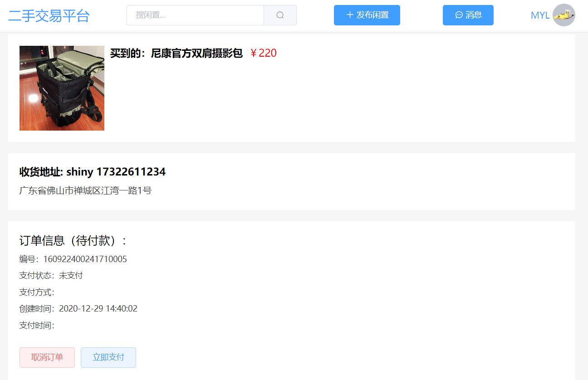

## 管理订单功能

​	 卖家可以确认发货，买家可以确认收货。

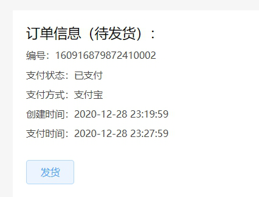

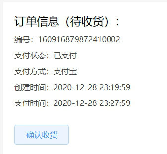

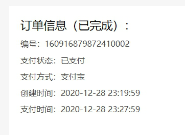

## 个人中心功能

​	 个人中心可以看到发布的闲置，下架的闲置，收藏的闲置，卖出的闲置和买到的闲置。

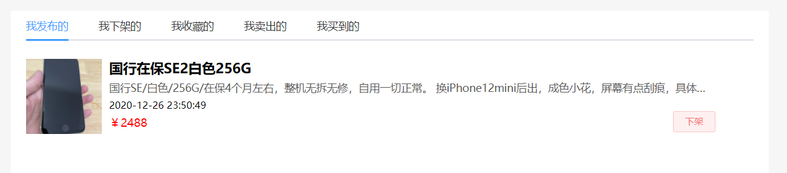

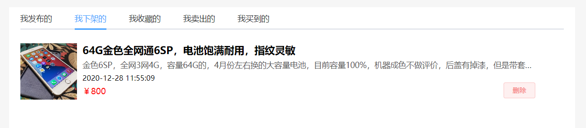

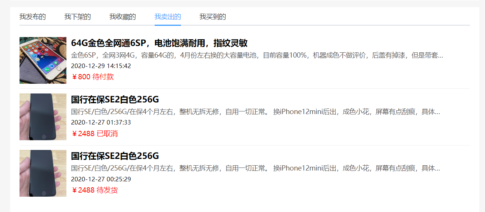

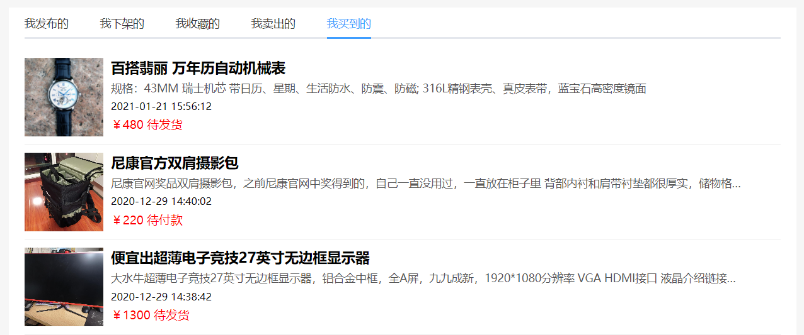